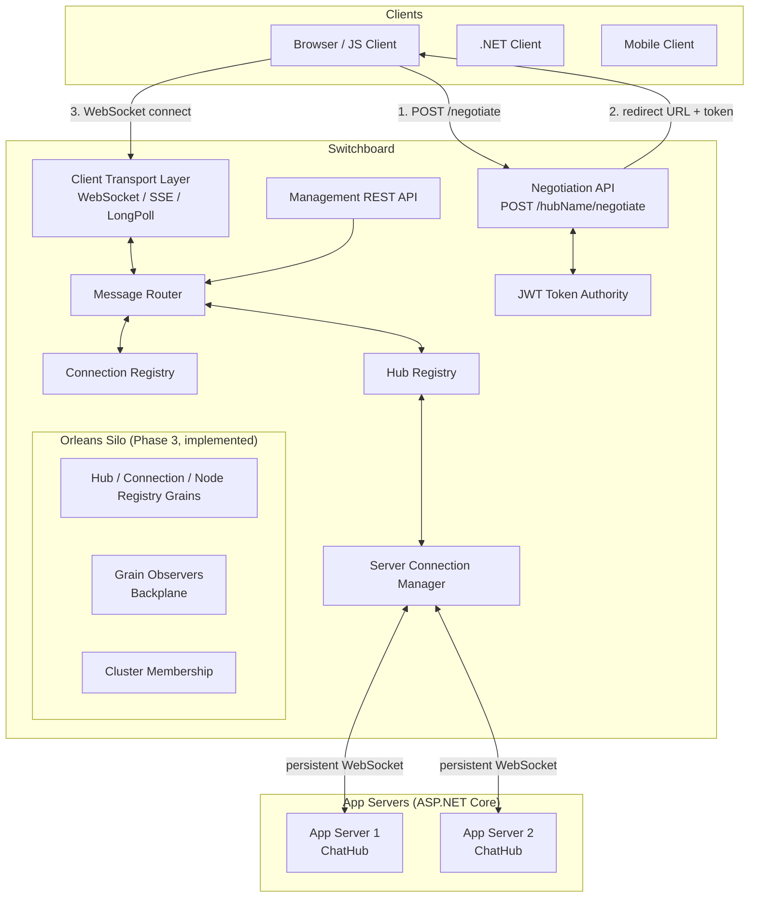
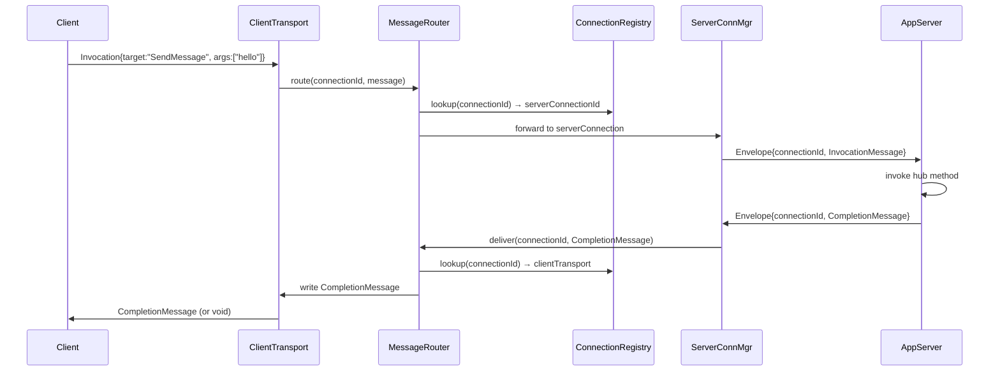
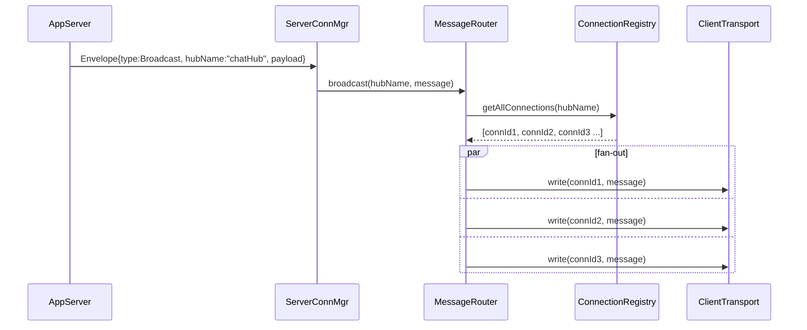
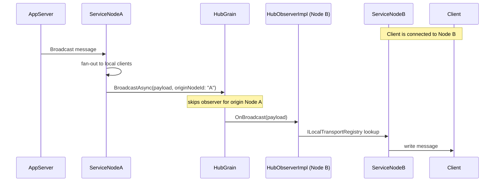

# System Architecture

## High-Level Topology

The service sits between clients and app servers, acting as the sole point of contact for client connections.



---

## Components

### Negotiation API

**Responsibility:** Handle the two-step SignalR negotiation (see [Protocol §1.1](03-protocol.md#11-negotiation)). Step 1 returns a redirect response (this service's `https://` URL + a short-lived JWT); step 2 (the client re-negotiating with that token) returns the connection identifiers and transport list.

**Inputs:** `POST /{hubName}/negotiate?negotiateVersion=1`  
**Outputs:**
- Step 1 (redirect): JSON with `url` (https), `accessToken`
- Step 2 (connect): JSON with `connectionId`, `connectionToken`, `negotiateVersion`, `availableTransports`

**Key behaviors:**
- Generates a unique `connectionId` (GUID) and embeds it in the step-1 JWT
- Issues a JWT signed with the service's private key, embedding the `connectionId`, `hubName`, and expiry
- Constructs the `https://` URL pointing back to this service (the client derives the `wss://` transport scheme itself)
- Mints the opaque `connectionToken` at step 2 and returns it for use as the transport `id`
- Optionally forwards the negotiation to the app server first (to allow the app server to authenticate and inject claims)

---

### Client Transport Layer

**Responsibility:** Accept inbound connections from clients and maintain them as long as the client is connected. Supports three transports in order of preference:

1. **WebSocket** — full-duplex, preferred
2. **Server-Sent Events** — server-to-client only; client sends via HTTP POST
3. **Long Polling** — request/response pairs; fallback for constrained environments

Each accepted connection is handed off to the Message Router as an `IClientTransport` abstraction. The transport layer is responsible for framing (JSON uses `\x1e` record separator; MessagePack uses length-prefixed frames) and for sending ping/pong keep-alives.

---

### Server Connection Manager

**Responsibility:** Maintain persistent WebSocket connections from app servers to this service. App servers initiate these connections using the SignalR Service SDK (or a lightweight connector library provided by this project).

**Key behaviors:**
- Maintains a minimum pool of connections per hub (configurable, default: 5)
- Performs a protocol handshake (`HandshakeRequest` / `HandshakeResponse`) on each new server connection
- Multiplexes many logical client connections over a small number of physical server connections
- Monitors connection health via periodic pings; reconnects automatically on failure
- Load-balances which server connection handles a new client

---

### Message Router

**Responsibility:** The central message dispatch engine. Routes messages between clients and app servers in all directions.

**Routing paths:**
- **Client → App Server:** Client sends an Invocation message → router looks up client's assigned server connection → forwards with connection ID envelope
- **App Server → Client:** Server sends a targeted response → router looks up client connection ID → writes to that client's transport
- **Broadcast (App Server → All Clients):** Server sends a broadcast → router iterates all client connections for the hub → writes in parallel
- **Group Message:** Router looks up group membership set → fans out to each member connection
- **User Message:** Router looks up all connections for a userId → fans out

---

### Connection Registry

**Responsibility:** Authoritative store of all active client connection state.

**Single-node:** In-memory `ConcurrentDictionary`. Zero latency, zero dependencies.

**Clustered:** Orleans grain-based registry keyed by `connectionId` (see [Orleans Silo](#orleans-silo-phase-3) below). Each service node owns a subset of connections; the grains are the shared truth.

**State per connection:**
```
connectionId  → hubName, userId, serverConnectionId, transport, groups[], connectedAt, lastSeen
```

---

### Hub Registry

**Responsibility:** Maps hub names to the set of server connections currently available for that hub.

```
hubName → [ ServerConnection, ServerConnection, ... ]
```

Used by the Message Router to find a server connection when routing a client message, and by the Server Connection Manager to register newly established server connections.

---

### Orleans Silo (Phase 3, implemented)

**Responsibility:** Hosts the distributed grain actors that provide shared state and message routing across service nodes in a clustered deployment. The silo runs co-located within each service node process — there is no separate Orleans server.

**Grain types (as implemented):**
- `IHubGrain` — per-hub client-connection membership (backs diagnostics, not the fan-out hot path); the cluster-wide server-connection inventory and least-loaded assignment (Phase 3 Slice 4, plan decision D18); and the observer subscriptions that make it the backplane's cross-silo fan-out coordinator for the hub
- `IConnectionGrain` — maps a `connectionId` to its owning node ID and full record; used for targeted `send_to_connection`, for resolving where a cross-node `AddToGroup`/`RemoveFromGroup`/`CloseConnection` actually needs to land, and for the group/user grain updates below
- `IGroupGrain` / `IUserGrain` — authoritative membership sets, consulted for management-API queries and disconnect cleanup — **never** on the fan-out path (see below)
- `INodeRegistryGrain` — each node's `InternalUrl`, published at startup and removed at shutdown; backs the SSE/Long Polling internal forward hop (Phase 3 Slice 5, plan decision D19)
- `IConnectionTokenOwnerGrain` — keyed by the opaque `connectionToken` itself, tracks which node claimed an SSE/Long Polling transport (see the `connectionToken` correction note in [03-protocol.md §1.1](03-protocol.md))
- `IPendingConnectionGrain` — the step-2-negotiate-to-transport-upgrade bridge (`IPendingConnectionStore`), made a grain from Phase 3 Slice 1 onward so a client can negotiate on one node and open its transport on another

**Fan-out never queries a membership grain, even though one exists:** group and user *sends* are published **by name** (plan decision D17) — `IHubGrain`'s broadcast/group/user fan-out calls every subscribed node's observer, and each node resolves membership (who's actually in that group, locally) and per-protocol payload selection against its own node-local `ILocalTransportRegistry` cache, not `IGroupGrain`/`IUserGrain` — a grain round trip on every message would be far too slow. Keeping that node-local cache in sync when a client's assigned app server lives on a different node than the client itself is exactly what a Phase 3 Slice 7 bug fix had to add (an `AddToGroup`/`RemoveFromGroup` envelope forwarded to the connection's actual node when it isn't local — see [00-review-findings.md § Phase 3 Results](00-review-findings.md#phase-3-scale-out--resilience-results-2026-07-28)).

**Grain observers** serve as the backplane channel: each node registers a local `HubObserverImpl` (an `IHubObserver` / `IGrainObserver`) with the relevant hub grain, not just once at startup but on a recurring heartbeat (`ObserverHeartbeatService`, plan decision D16) — a hub grain deactivation silently drops every subscription with no error anywhere, so periodic re-subscription is what makes delivery self-heal rather than requiring an operator restart. Broadcasts and group/user messages are delivered by the grain calling each registered observer directly (skipping the origin node); each observer delivers to local client transports via `ILocalTransportRegistry`. See [ADR-003](07-adr/ADR-003-backplane.md) and [Design §7](04-design.md#7-backplane-design-phase-3).

**Cluster membership** is stored in a shared SQL table (SQL Server, PostgreSQL, or MySQL via `Microsoft.Orleans.Clustering.AdoNet`) — schema vendored under `Keryhe.Switchboard.Orleans/Sql/` (the packages don't ship it), with driver selection a host-level DI concern rather than a dependency the Orleans project itself takes on. This allows nodes to join and leave the cluster without manual coordination.

**Single-node mode:** The Orleans silo runs with in-memory storage and in-memory clustering. No SQL dependency. Clustered/multi-node features are unlocked by switching to the ADO.NET providers via configuration (`UseOrleansCluster = true`) — both modes are maintained and tested, not just the clustered one.

---

### JWT Token Authority

**Responsibility:** Issue and validate short-lived JWT tokens used by clients to authenticate their WebSocket connection to this service.

- **Issuer:** This service (configurable issuer name)
- **Audience:** This service's client transport endpoint
- **Claims:** `connectionId`, `hubName`, `sub` (userId, if authenticated), `exp` (short TTL, e.g. 30 seconds — long enough to complete the WebSocket upgrade)
- **Signing:** HMAC-SHA256 with a configurable secret (or RSA for multi-node deployments)

App servers that need to authenticate users before redirecting them can call this service's negotiate endpoint internally, receive the token, then forward it to the client — allowing the app server to add custom claims (e.g., `userId`, `role`) before the token is issued.

---

### Management REST API

**Responsibility:** Allow external systems (admin tools, other services) to send messages and query connection state without establishing a SignalR connection.

Endpoints (see [Protocol Specification](03-protocol.md) for full details):
- Broadcast to hub
- Send to specific user
- Send to group
- Add/remove connection from group
- List connections for a hub

---

## Data Flow Diagrams

### 1. Client Connection Establishment

```mermaid
sequenceDiagram
    participant Client
    participant AppServer
    participant NegotiateAPI
    participant JWT
    participant ClientTransport

    Note over Client,JWT: Step 1 — redirect issuance
    Client->>AppServer: POST /chatHub/negotiate
    AppServer->>NegotiateAPI: Forward negotiate (with user identity)
    NegotiateAPI->>JWT: Issue token(connectionId, hubName, userId)
    JWT-->>NegotiateAPI: signed JWT
    NegotiateAPI-->>AppServer: redirect {url (https), accessToken}
    AppServer-->>Client: redirect {url, accessToken}

    Note over Client,NegotiateAPI: Step 2 — re-negotiate at the service
    Client->>NegotiateAPI: POST {url}/negotiate (Bearer accessToken)
    NegotiateAPI->>JWT: Validate token → extract connectionId
    NegotiateAPI-->>Client: {connectionId, connectionToken, availableTransports}

    Note over Client,ClientTransport: Step 3 — connect
    Client->>ClientTransport: WebSocket upgrade (id=connectionToken, access_token=JWT)
    ClientTransport->>JWT: Validate token; resolve connectionToken
    ClientTransport->>ConnectionRegistry: Register connection
    ClientTransport-->>Client: 101 Switching Protocols
    ClientTransport->>Client: SignalR handshake {"protocol":"json","version":1}
    Client-->>ClientTransport: handshake ack {}
```

> **Note:** The app server may handle negotiation entirely itself (not forwarding to this service) and simply redirect the client with a self-generated URL+token. Either pattern is supported.

---

### 2. Hub Method Invocation (Client → Server → Client)



---

### 3. Broadcast Message (Server → All Clients)



---

### 4. Scale-Out Routing (Clustered — Phase 3, implemented)



---

## Key Design Principles

1. **Zero app-server code changes for basic use.** Existing ASP.NET Core apps add a NuGet package and one `AddSwitchboardConnector()` call. Hubs, hub methods, and client-side code remain unchanged.

2. **Transport and protocol agnostic.** The core routing logic does not know whether a client is WebSocket or SSE, JSON or MessagePack. These are resolved at the transport/protocol layer and abstracted.

3. **Backpressure-aware fan-out.** Broadcast fan-out uses `System.IO.Pipelines` and does not block the router awaiting slow clients. Slow clients accumulate backpressure; the service drops or closes connections that cannot keep up (configurable policy).

4. **Stateless-enough service nodes (Phase 3).** In clustered mode, *authoritative* connection state (who owns what, cluster-wide server-connection assignment, group/user membership by name) lives in grains, not on any one node — any node can answer a management API query about any connection, and a node can be restarted without an operator coordinating anything (Phase 3 Slice 7's own milestone). What deliberately stays node-local and is never replicated to grain state: the physical transport handle itself (`IClientTransport`, `ILocalTransportRegistry`) and the node-local hub/group/user membership indexes used to resolve fan-out without a distributed lookup (plan decision D14) — a live socket is only ever meaningful on the one node that physically holds it.
